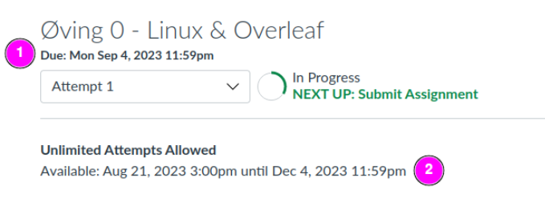

## Når er fristen for å levere inn rapportene ?
På øvingene så vil en se 2 frister.

**1 )** er veiledende / Soft frist som betyr at en bør være ferdig innen denne fristen, men det gjør ikke noe om en leverer noe seinere, så lenge du leverer øvingen innen hard  deadlinen og får den godkjent!

**2 )** Dette er hard deadline, altså leverer du etter dette så er du forsein og vil ikke få godkjent faget! Så må passe på å levere i **GOD** tid før denne dato'en og få øvingen godkjent innen denne fristen

---

## Må jeg gjøre alle 7 innleveringene (øving 0 - 6) for å få godkjent faget.
Ja dette stemmer, alle 7 øvingene må være godkjent innen den endelige fristen også kalt en Hard frist.

---

## Om jeg ikke får bestått på en eller flere av innleveringene, kan jeg få lov til å levere på nytt ?
Ja, om en ikke får bestått på en eller flere av innleveringene så vil en få lov til å levere så mange ganger en orker frem til en får bestått.
???+ note
    Husk, dette kan varierer fra fag til fag.

