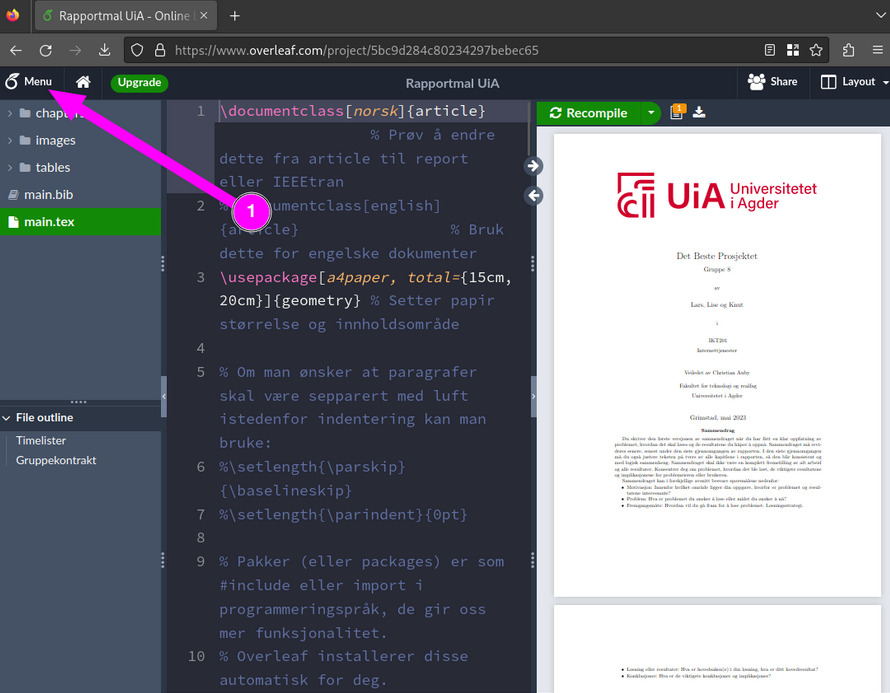
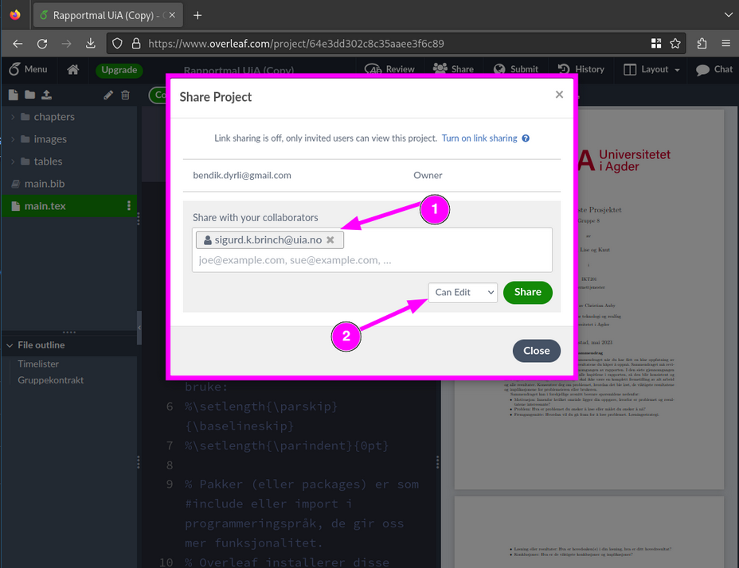

# Hvordan kan jeg lage en kopi av Overleaf malen.
Ved å passe på at en har laget en konto på Overleaf først og logget inn på denne. Så skal en kunne trykke på lenken til templaten som ligger i oppgaven.

Herfra skal en kunne trykke på "Menu"

Så trykke på **Copy Project**

???+ warning
    Får en ikke opp denne, så må en sjekke at en er logget inn på overleaf

Herfra vil en få opp en dialogboks hvor en kan sette et navn på prosjektet  eller også malen en skal kopiere over

Når en har satt et passende navn, så er det bare å trykke *Copy* Så vil malen bli kopiert over til din overleaf profil, og du kan nå begynne å redigere på denne

Om du er på gruppe med andre studenter så kan du nå gi de tilgang til å være med å sammarbeide på rapporten.
Dette gjør en ved å trykke på *Share* knappen

Herfra vil du få opp en dialogboks hvor du kan legge inn mailene til  de/dem du vil dele rapporten med.

1. her legger du inn mail addressen til personen/personene du skal dele dokumentet med.
2. Her bestemmer du hva slags rettigheter de skal ha.
Også er det å trykke på *Share*, så vil en invitasjon ble sendt ut til de/dem du har valgt å dele rapporten med.

