# Oppsett av SSH nøkkler og Wireshark SSH Remote Capture
> Denne guiden er ment for å gjøre klar den virtuelle maskinen til øving 3 i IKT100.

Før en kommer i gang her så må en først ha funnet IP'en til sin virtuelle maskin, dette vil en finne mer informasjon om [her](../vm.md)

## SSH Nøkkler
Når en skal sette opp bruk av ssh nøkkler for å logge seg på den virtuelle maskinen, så må en først og fremst passe på at en er logget inn på den virtuelle maskinen.

Før en begynner å lage ssh nøkklene så må en sørge for at ``.ssh`` mappen eksisterer. Dette kan en gjøre ved å skrive ``mkdir .ssh``, om den alt eksisterer så vil kommando'en gi output om at den klarer ikke å lage mappen, for den eksisterer alt. Om den ikke finnes så vil den bli laget, uten å gi noe output.

Her fra så vil en bruke kommando'en ``ssh-keygen`` denne kommandoen vil da lage et nøkkelpar en vil bruke til logge seg på den virtuelle maskinen med. Dette betyr da at en slipper å skrive passordet sitt.

???+ note
    I et ssh nøkkelpar så består det av en private nøkkel, og en public nøkkel. Den private nøkkelen skal en aldri dele med andre enn seg selv. Mens public nøkkelen kan en dele med hvem en vil.

Når en skal begynne å lage ssh nøkkelparet, så skal en bruke denne kommandoen``ssh-keygen -t ed25519 -f .ssh/ikt100``.
Det denne kommandoen gjør er at den lager et nøkkelpar med kryptering ed25519, og legger privat- og public nøkkelen i .ssh mappen og gir den navnet ikt100.

Når en kjører kommandoen vil en få spørsmål om å oppgi en passphrase, dette er ment for å gjøre ssh nøkkelen sikkrere. For skulle den komme på avveie så kan hvem som helst bruke den til å logge inn på alle serveren hvor dens sin public nøkkel blir brukt. Det er ikke et krav om å ha passphrase, så her trenger en ikke å skrive inn noe og kan trykke seg forbi denne.

Nå kan en sjekke .ssh mappen med ``ls .ssh`` for å se at det har nå blitt laget to filer.

- ikt100
    - private nøkkel
- ikt100.pub
    - public nøkkel

privat nøkkelen skal en aldri dele med andre enn seg selv, mens da public nøkkelen kan en gi til alle hvor en har behov for å logge seg på de/dems sin linux maskin.

Så nå for å gi laptopen din tilgang til å koble seg på den virtuelle maskinen så må du legge public nøkkelen i en fil som heter authorized_keys på den virtuelle maskinen, denne filen skal ligge i .ssh mappen. Først må en passe på at en står i .ssh mappen. Så kan en kjøre denne kommandoen for å legge ikt100 public nøkkelen ligger i authorized_keys  ``cat ikt100.pub >> authorized_keys``

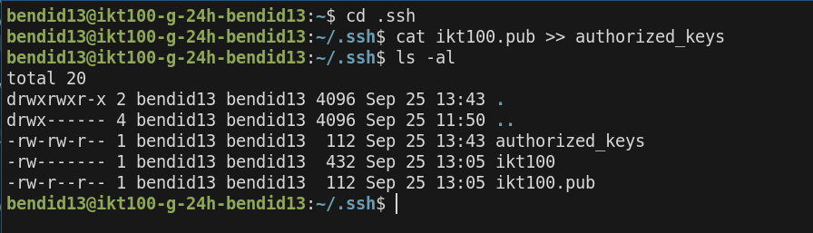

Nå mangler en bare å legge privat nøkkelen inn på maskinen sin. Dette er da filen med navn ikt100

### Windows
En begynner med å trykke på Windows-tasten, og skriver inn Terminal og trykker inn på appen som heter Terminal.

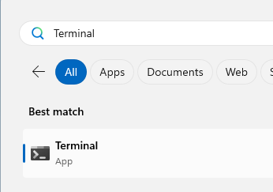

Når en åpner Windows terminal, så vil den alltid åpne seg opp i hjemmemappen til brukeren.

Så må en sjekke at mappen med navn ``.ssh`` eksisterer, dette kan en gjøre ved å skrive ``ls .ssh``. I mitt tilfelle så finnes .ssh mappen, så da trenger jeg ikke å lage den selv. Skulle .ssh ikke finnes så kan en lage denne med ``mkdir -m 0700 .ssh``. En må bruke ``-m 0700`` for å passe på at .ssh mappen for riktigte rettigheter.

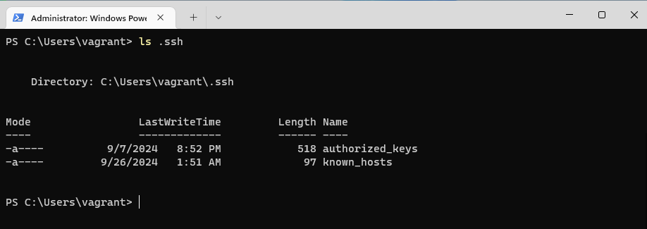
Så for å flytte ned ikt100 ssh nøkkelen fra den virtuelle maskinen, så kan en anvende en kommando som heter scp, for å hente ned filen og plassere den i .ssh mappen. SCP står for Secure File Copy.

``scp bendid13@10.225.149.214:.ssh/ikt100 .ssh/ikt100``

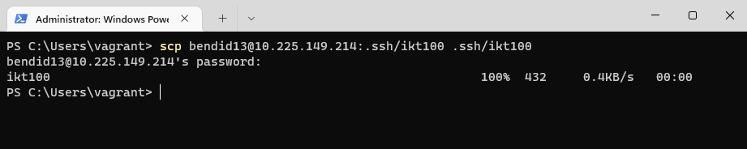

Nå kan kan en prøve å logge seg inn på den virtuelle maskinen ved hjelp av ssh nøkkelen. ``ssh bendid13@10.225.149.214 -i .ssh/ikt100``
Kommandoen en bruker for å logge seg på den virtuell maskinen er ganske identiskt, men her så har jeg med et ekstra paramter ``-i`` betyr identity_file.  Her legger jeg med stien til hvor ikt100 privat nøkkelen ligger.

Her kan en nå se at jeg kan logge meg inn på den virtuelle maskinen uten å måtte skrive passordet :D.

### Macos

Her så starter en med å trykke command+space og da vil ene få opp spotlight, her kan en søke etter terminal også trykke seg inn på den som heter Terminal.app

Terminalen vil se ut som dette.

Så kan en begynne med å sjekke om .ssh mappen eksisterer, om den ikke eksisterer så må en lage den med ``mkdir .ssh``
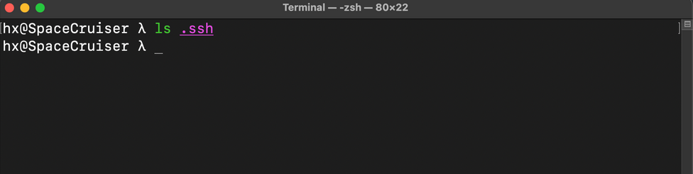

Etter dette kan jeg bruke SCP(secure file copy) kommandoen til å hente ned ikt100 nøkkelen fra den virtuelle maskinen og ned til din maskin.
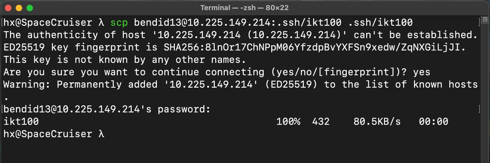

Så etter dette kan en prøve å logge seg på den virtuelle maskinen og skal da kunne logge seg uten å måtte skrive passord.
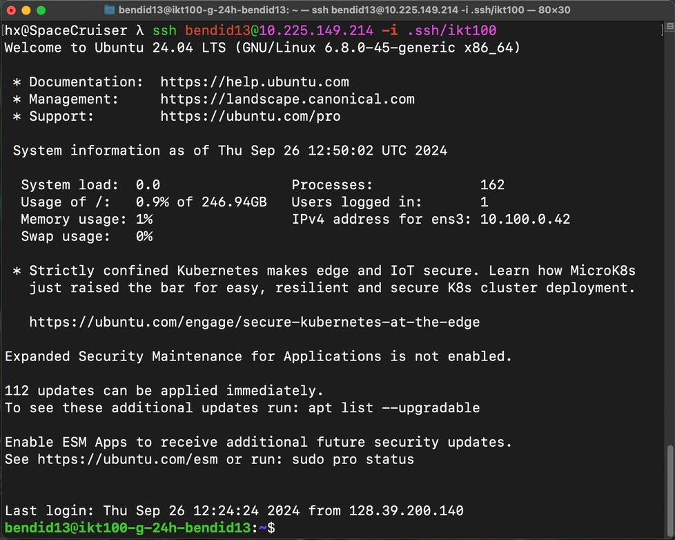

## Passordløs Sudo

Passordløs sudo, er at en skal slippe å måtte skrive passordet på nytt når en skal ta i bruk kommando'er som trenger administrator rettigheter.

???+ note
    visudo er en kommando som gjør det enkelt og trygt å redigere sudoers filen/filene, skulle en gjøre noe feil så vil visudo si ifra om at det en har skrevet ikke er rett.

For å sette opp dette så må en bruke kommandoen ``sudo visudo -f /etc/sudoers.d/bendid13``. Husk å bytt ut bendid13 med ditt eget uia brukernavn. Når en har kjørt denne kommandoen så vil en bli møtt med et vindu, hvor en kan skrive inn tekst. Her skal en skrive ``bendid13 ALL=(ALL) NOPASSWD:ALL``, hvor en sier at brukeren bendid13 skal ha tilgang til alt, men at den skal slippe å måtte skrive passord når en skal bruke sudo.

Så kan en lagre og gå ut av programmet, ved å trykke Ctrl + X så vil en få beskjed om å lagre filen. Her skal en bare trykke ``y`` også får en spørsmål om hvor en skal lage filen, her trenger en ikke å endre noe og kan bare trykke ``enter``.

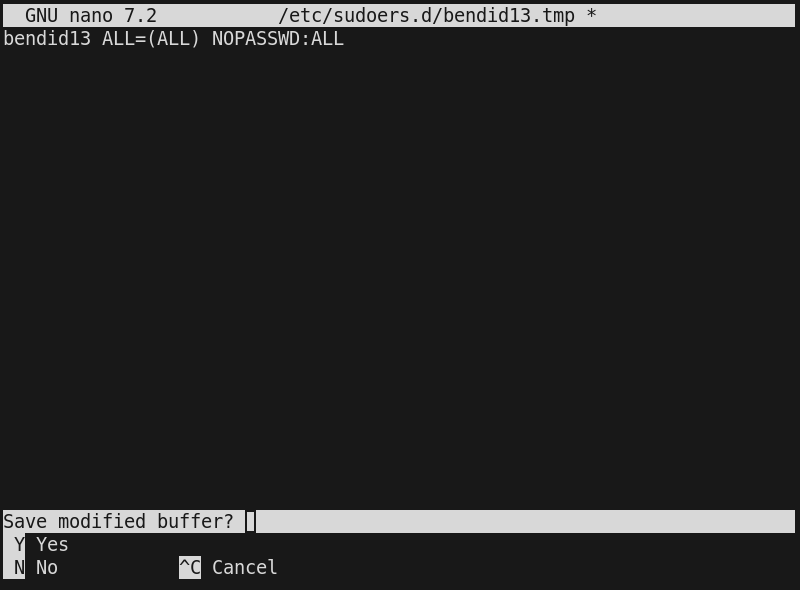

Nå kan en verifisere at det fungerer som det skal så nå kan en prøve med å skrive ``sudo -i`` og da skal en bli root brukeren uten å måtte skrive inn passordet. 
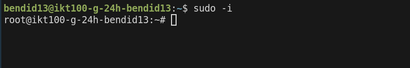

Her ble jeg logget inn som root uten å måtte skrive passord, og da funker det som det skal :D. En kan trykke Ctrl+d eller skrive exit for å logge ut som root.

## Wireshark SSH Remote Caputure

For å begynne å sette opp Wireshark SSH Remote Capture, så må en sørge for å ha installert Wireshark, https://www.wireshark.org/download.html

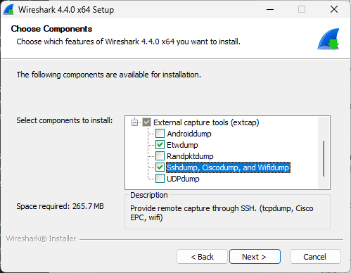

???+ warning
    På windows så er det viktigt at en huker av på komponenten, ``Sshdump, Ciscodump and Wifidump`` under installasjonen av Wireshark. Dette er ikke nødvendigt på macos eller linux.

Etter en har installert Wireshark, så kan en starte opp programmet og det vil se slikt ut når en åpner det.

Så for å sette opp SSH Remote Capture, så trykker en på tannhjulet til venstre for ``SSH remote capture: sshdump`` som er markert på skjermbildet (1).

Herfra vil en bli møtt med en nytt vindu, hvor en da må fylle inn ip addressen til sin virtuelle maskin inn i feltet ``Remote SSH server address``

Så må en trykke seg over til ``Authentication`` fanen

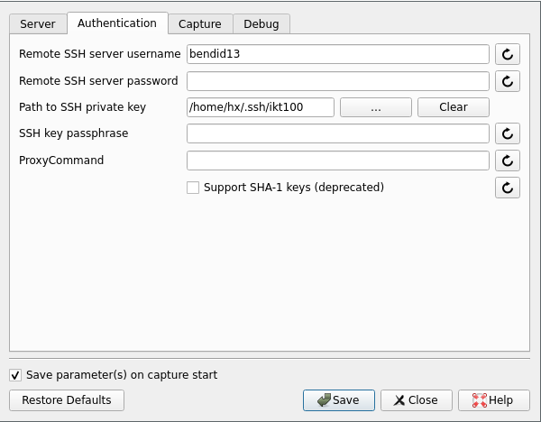

Her må en fylle inn ditt uia brukernavn under ``Remote SSH server username`` og så legge inn stien til ssh nøkkelen under ``Path to SSH private key``, en vil finne den på disse stiene.

- Linux
    - ``/home/bendid13/.ssh/ikt100``
- Macos
    - ``/Users/bendid13/.ssh/ikt100``
- Windows
    - ``C:\Users\bendid13\.ssh\ikt100``

Så må en videre til ``Capture`` fanen.
Her må en passe at ``Remote capture command selection`` er satt til tcpdump og,``Gain capture privilege on the remote machine`` er satt til sudo.
 Så er det bare å trykke Save.

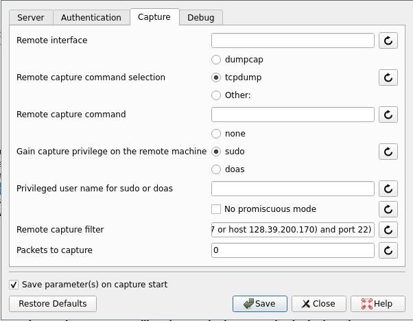

Så nå kan en bare trykke på navnet ``SSH Remote Capture: sshdump``

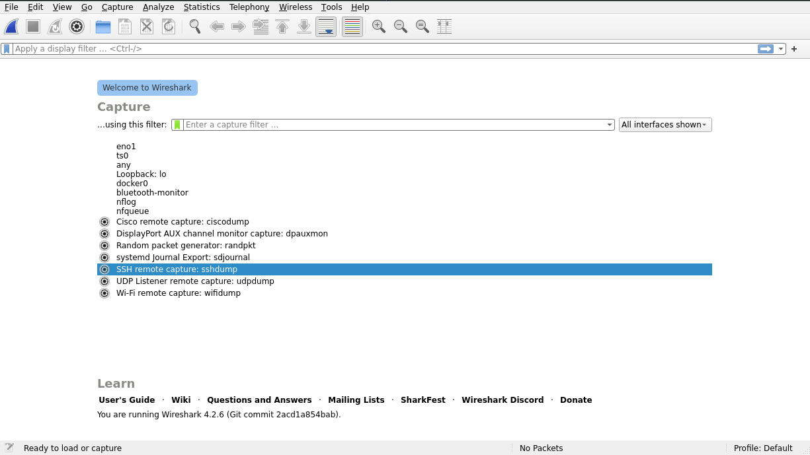

Da vil det komme opp et nytt vindu som viser trafikken som foregår på den virtuelle maskinen.

Skulle det være at noe ikke fungerer som det skal så ta kontakt på lab eller på discord :)
