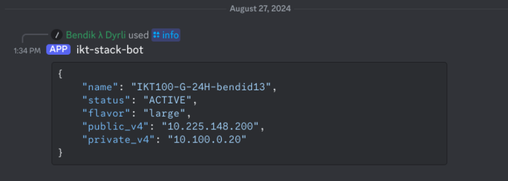
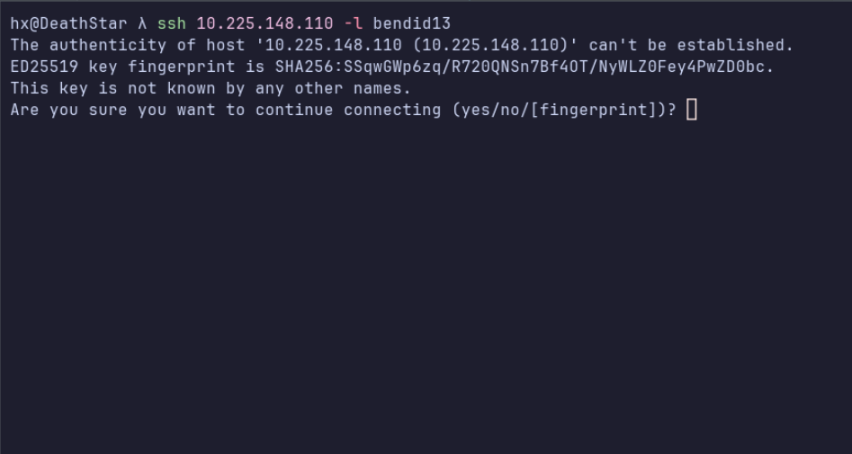
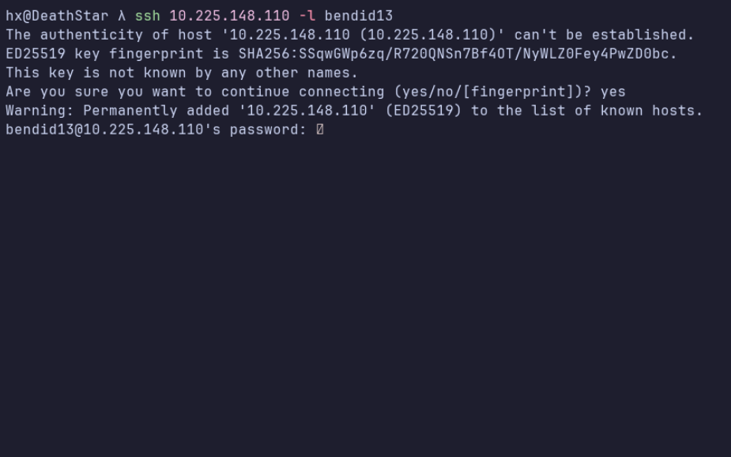
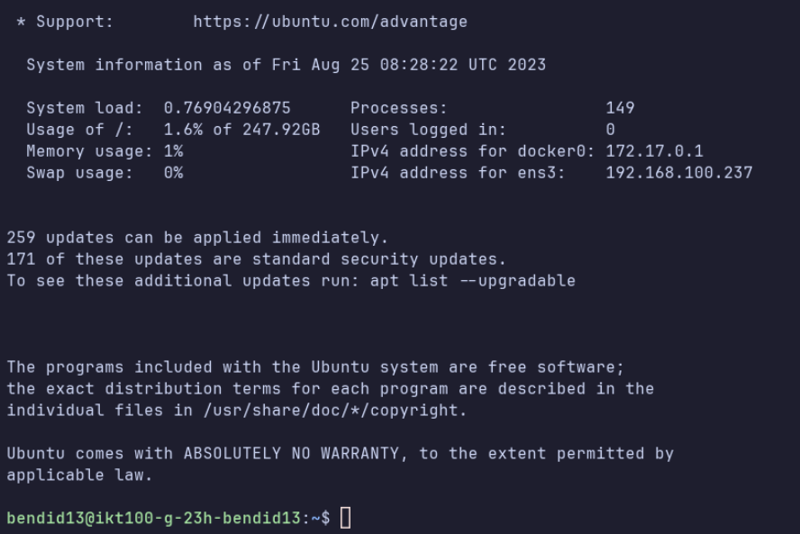

# Hvordan koble seg på virtuell maskin
Denne finner du med å gå til #bot kanal'en og skrive ``/info username: <uia brukernavn>``
Så om jeg skulle funnet ip'en til  min virtuelle maskin,  så veit jeg at jeg har mailen ``bendid13@uia.no``  så da må jeg skrive kommando'en ``/info username:bendid13``.

Herfra så får en del info om info om den virtuelle maskinen en har fått tildelt

- **Name**: Er navnet på den virtuelle maskinen.
- **Status**: Forteller om den virtuelle maskinen er på eller av
- **Flavor**: Sier hva slags spec maskinen har, så her betyr large-server at en har 8 vcpu, 16g ram og 256g disk.
- **Public_v4**: Dette er den IP addressen en skal bruke når en skal koble på den virtuelle maskinen.
- **Private_v4**: Dette er den virtuelle maskinen sin private IP addresse, dette er den som er internt i nettverket. 

Så nå har en fått tak i IP addressen til min virtuelle maskin, så da kan jeg gå videre til å koble meg på den.

???+ note
    For å kunne nå den virtuelle maskinen må en enten være på campus grimstad og være påkoblet det trådløse nettverket eduroam, eller så kan en anvende UiA sin VPN løsning for å koble seg på den virtuelle maskinene uten å være på uia, mer info om den finner en [her](https://www.uia.no/studier/for-studenter/uia-hjelp/it/vpn.html)

Herfra så bruker jeg en kommandoen ``ssh``, som er OpenSSH sin remote login client.
en kan lese mer om denne her, 

- [Text - SSH Manual](https://linux.die.net/man/1/ssh)
- [Video - SSH Explained](https://youtu.be/tZop-zjYkrU?t=158)

Så på de fleste maskinene og nå windows, så skal en finne ``ssh``  kommandoen
**Windows**: Så finner en denne ved å åpne CMD eller Powershell  og skrive ssh. 
**Macos**: Åpne en terminal og skrive ssh

Jeg bruker linux, så når jeg skrive ssh og trykker enter så vil det se slik ut. (Den skal se mer eller mindre identisk ut på andre operativsystemer)

Så for å koble meg på den virtuelle maskinen så må jeg finne frem ip'en jeg fikk fra discord botten, som da var verdien fra public_v4, som for meg var 10.225.148.110

Da bruker jeg kommando'en som vist her  ``ssh 10.225.148.110 -l bendid13`` .
Hvordan jeg kommer frem til at jeg må sette ip'en først og så skrive -l og mitt brukernavn. Er at jeg leser hva som kommer ut når jeg skrev ssh og trykte enter. 

På de fleste linux programmene når en skriver kommando'en og trykker enter så vil en få en liten oversikt over hvilke parametere den tilbyr og hva de gjør.

- Så det jeg så etter når jeg skrev ssh,  er at jeg må ha en måte å koble med på IP addressen, det blir da destination (1) .
- Så må jeg legge inn brukernavnet da ser jeg på (3) at den har en kommndo login_name som er hvor jeg kan legge inn brukernavnet mitt.
- Jeg kan da plassere kommando'en etter destination (2)

Da kan jeg skrive ``ssh 10.225.148.110 -l bendid13`` også trykke enter for å kjøre kommando'en.

Nå har jeg trykket enter og får så opp dette.  "serveren som sier "Hei, autentisitet av vert ....  kan ikke etableres"  
Dette betyr bare at du ikke har koblet deg på denne serveren før og ssh sier i fra at fingeravtrykket til serveren ikke er kjent, så lenge en er kjent med serveren så går det alltid greit å skrive ``yes`` for å gå videre.

???+ note
    Når en skriver inn passordet sitt her så vil det ikke vises tegn for hva du har skrevet. Dette er ment som en sikkerhets-egenskap for at noen skal kunne se hvor lang eller kort passord du har.

Nå får en spørsmål om å skrive inn et passord, det passordet en skal skrive inn her er det passordet du bruker for å logge deg inn på canvas.
 Etter en har skrevet passordet så er det bare å trykke enter.

Det kan ta litt tid å logge seg inn første gang, dette er fordi den virtuelle maskinen autentiserer brukere via [LDAP](https://www.redhat.com/en/topics/security/what-is-ldap-authentication), må få svar tilbake fra serveren at brukeren er gyldig.

Om du får samme skjerm som jeg har fått over, og at det står ditt brukernavn istedenfor mitt, så betyr det at du har fått logget deg inn på din virtuelle maskin. 
Gratulerer 🥳